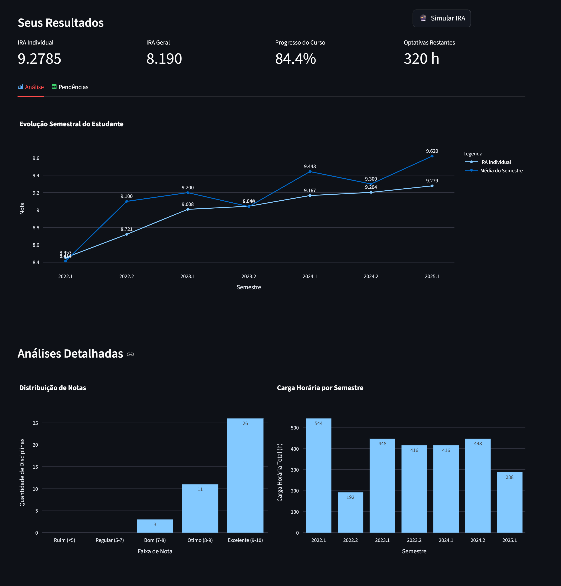

# Calculadora de IRA - UFC

Uma aplicação web interativa construída com Streamlit para analisar históricos acadêmicos da Universidade Federal do Ceará (UFC), extraídos do sistema SIGAA. A ferramenta calcula automaticamente o Índice de Rendimento Acadêmico (IRA) Individual e Geral, e apresenta um dashboard com métricas e visualizações sobre o desempenho do aluno.



## ✨ Funcionalidades

- **Upload de Histórico**: Faça o upload do seu histórico escolar em formato PDF diretamente na aplicação.

- **Cálculo Automático de IRA**:

  - **IRA Individual**: Calculado com base nas suas notas, carga horária e penalidades por trancamento.

  - **IRA Geral**: Calculado de forma normalizada, permitindo a comparação do seu desempenho com a média e o desvio padrão do seu curso.

- **Dashboard Interativo**:

  - **Métricas Principais**: Cards com o seu IRA Individual, IRA Geral e a percentagem de conclusão do curso.

  - **Gráfico de Evolução**: Acompanhe a evolução do seu IRA Individual acumulado ao longo dos semestres.

  - **Análises Detalhadas**: Gráficos de distribuição de notas e da carga horária cursada por semestre.

  - **Acompanhamento de Pendências**: Uma tabela que extrai e exibe as disciplinas obrigatórias que ainda faltam para a conclusão do curso.

- **Simulador de IRA Futuro**: Uma ferramenta para adicionar disciplinas futuras, o período em que pretende cursá-las e as notas esperadas, permitindo ao aluno projetar o impacto no seu IRA.

- **Página Informativa**: Uma página dedicada a explicar as regras e fórmulas por trás do cálculo do IRA.

- **Contribuição dos discentes**: Um formulário para que os usuários possam sugerir a adição de novos cursos à base de dados da aplicação.

## Estrutura do Projeto

```
ufc-ira-calculator/
├── .streamlit/
│   ├── config.toml         # Configurações de tema e UI
│   └── secrets.toml        # Credenciais do banco de dados (local)
├── assets/                 # Imagens estáticas como logos e previews
├── actions/                # Scripts para automação e tarefas de backend
│   ├── authorize_gdrive.py # Script único para gerar credenciais do Google Drive
│   ├── resolve_suggestion.py # Script para aprovar sugestões enviadas
│   └── sync_proofs_to_drive.py # Script agendado para sincronizar comprovantes
├── pages/
│   └── 1_About.py          # Código da página "Sobre"
├── src/
│   ├── calculations.py     # Lógica dos cálculos matemáticos do IRA
│   ├── config.py       # Configurações comuns entre as páginas
│   ├── components.py       # Componentes de UI reutilizáveis (ex: header)
│   ├── database.py         # Funções de comunicação com o banco de dados
│   └── pdf_parser.py       # Lógica para extrair dados do PDF
├── Dockerfile              # Instruções para construir a imagem Docker da aplicação
├── app.py                  # Ponto de entrada e UI da página principal
├── main.py                 # Código simples que roda pelo terminal para calcular o IRA
└── requirements.txt        # Dependências do projeto
```

## 🚀 Como Executar Localmente

Você pode executar esta aplicação de duas maneiras: usando um ambiente virtual Python diretamente na sua máquina ou usando Docker para um ambiente containerizado e isolado.

### Opção 1: Executando com Ambiente Virtual Python (Tradicional)

#### 1. Configuração do ambiente

**a. Clone o repositório:**

```sh
git clone https://github.com/kelvinleandro/ufc-ira-calculator.git
cd ufc-ira-calculator
```

**b. Crie e ative um ambiente virtual:**

```sh
# Criar o ambiente
python -m venv .venv

# Ativar no Windows
.\.venv\Scripts\activate

# Ativar no macOS/Linux
source .venv/bin/activate
```

**c. Instale as dependências:**

```sh
pip install -r requirements.txt
```

**d. Configure os segredos (credenciais)**

Crie uma pasta `.streamlit` na raiz do projeto e, dentro dela, um arquivo `secrets.toml`. Adicione as suas credenciais do PostgreSQL:

```
# .streamlit/secrets.toml
[postgres]
host = "seu_host"
port = "5432"
dbname = "seu_banco"
user = "seu_usuario"
password = "sua_senha"
```

#### 2. Executando a Aplicação

Com o ambiente virtual ativado, execute o seguinte comando no terminal:

```sh
streamlit run app.py
```

A aplicação será aberta automaticamente no seu navegador padrão.

### Opção 2: Executando com Docker

#### 1. Configuração Inicial

Siga os passos **1.a** e **1.d** da "Opção 1" para clonar o repositório e criar o seu arquivo `secrets.toml`.

#### 2. Construindo a Imagem Docker

No terminal, na pasta raiz do projeto, execute o comando para construir a imagem:

```bash
docker build -t ira-dashboard .
```

- `-t ira-dashboard` dá um nome (tag) à sua imagem para que seja fácil de encontrá-la.
- `.` indica que o Docker deve procurar o `Dockerfile` no diretório atual.

#### 3. Executando o Container

Após a imagem ser construída, execute o container com o comando abaixo. Ele irá "montar" o seu arquivo `secrets.toml` local dentro do container.

```bash
docker run --rm -p 8501:8501 \
   -v $(pwd)/.streamlit/secrets.toml:/app/.streamlit/secrets.toml \
   --name ira-app \
   ira-dashboard
```

- `-p 8501:8501`: Mapeia a porta 8501 do container para a porta 8501 da sua máquina.
- `-v ...`: Monta o seu arquivo `secrets.toml` local dentro do container, permitindo que a aplicação se conecte ao banco de dados.
- `--name ira-app`: Dá um nome fácil de lembrar ao seu container em execução.

A aplicação estará disponível no seu navegador em **`http://localhost:8501`**.
